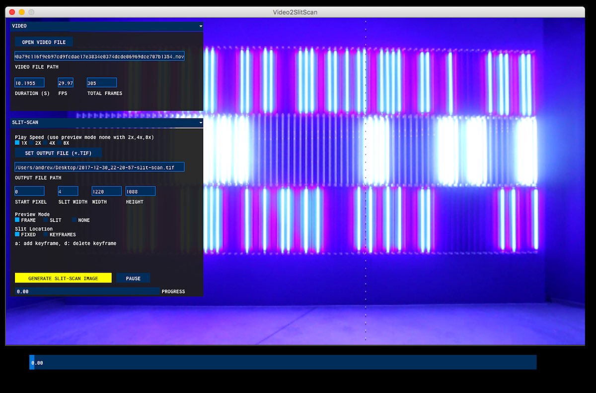

# Video-2-Slit-Scan
Video-2-Slit-Scan is an desktop application to create a single (high resolution) static image from slits of video.

## Install
**macOS** Download the [latest macOS build](https://github.com/andrewringler/video-2-slit-scan/releases/latest)

*Video-2-Slit-Scan is written in [Processing](https://processing.org/) / [Java](https://java.com) / [Gradle](https://gradle.org/) / [Eclipse](https://www.eclipse.org/) so should also easily run on Windows and Linux, but I have not created and tested their builds yet.*

## Screenshots

## Features
 * Given an input video, create a single output TIF grabbing a single vertical slice from each frame
 * Adjust position and size of slit
 * Manually adjust slit position as video plays
 * Create moving slits over time by specifying keyframes to interpolate between.
 * **Performance**. *Video-2-Slit-Scan* Should support very large input videos and very large output images. Videos are streamed in as needed, output images are not stored in memory but instead written to disk in chunks. *This allow allows previewing the output image using your OS image viewer during generation.*

## Background: Slit-scan Imaging
Slit-scan photography, imaging and cinematography has a long history. This app allows you to experiment with one slit-scan technique digitally (converting video to a single image). This app was originally commissioned by [Jan Kubasiewicz](http://jankuba.com/). I have since released it as open source.

## Developer Notes
### New Developer Setup
 * Install Eclipse Neon
 * Install Gradle
 * run after-pull.sh
 * Import Project Into Eclipse
 
### Build Mac Bundle:
gradle createDmg

### Create App Icon
 * Create PNG image 1024x1024
 * Convert to iconset folder with [Icon Generator](https://github.com/onmyway133/IconGenerator)
 * Tweak individual icons if need be
  rename icons to Apple's [latest scheme](https://developer.apple.com/library/content/documentation/GraphicsAnimation/Conceptual/HighResolutionOSX/Optimizing/Optimizing.html)
 * Rename folder to icon.iconset
 * Convert to icns file with
 `iconutil -c icns -o icon.icns icon.iconset`
  then copy into icon.icns into the doc/ directory
  
