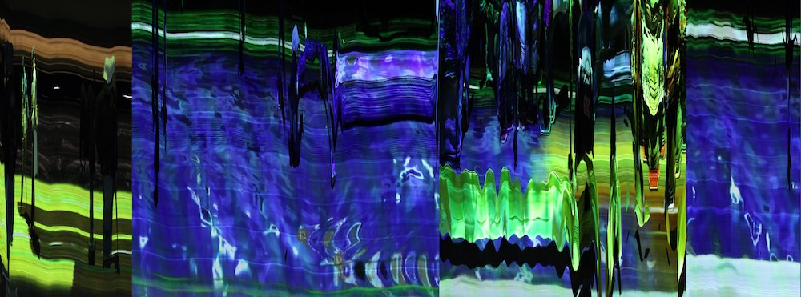
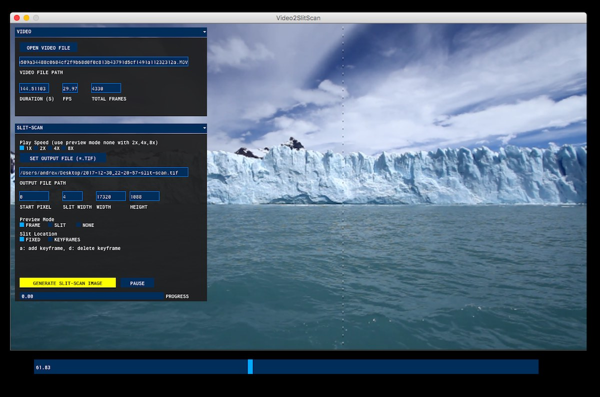
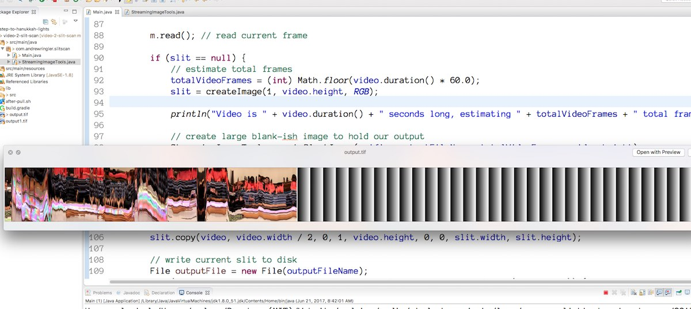

# Video-2-Slit-Scan
Video-2-Slit-Scan allows you to create a slit-scan image from a video. It provides a graphical interface for adjusting slit position and size. Video-2-Slit-Scan can support very large videos with modest RAM since it streams in the input video and writes out the output image to disk in chunks. Released for Windows and macOS (Mac/Apple/OS-X) as free software under the [MIT license](https://opensource.org/licenses/MIT) and makes use of FFmpeg binaries licensed under the GPU v3 see [LICENSE](LICENSE.txt).

*slit-scan generated from [Wellspring Fords video](https://andrewringler.com/2017-11-wellspring-fords/), 2017*

## Quickstart
### Install
#### macOS
   * Download [Video-2-Slit-Scan for Mac v0.2.6 Silicon](https://github.com/andrewringler/video-2-slit-scan/releases/download/v0.2.6/Video-2-Slit-Scan_0.2.6_Silicon.dmg) or [Video-2-Slit-Scan for Mac v0.2.6 Intel](https://github.com/andrewringler/video-2-slit-scan/releases/download/v0.2.6/Video-2-Slit-Scan_0.2.6_Intel.dmg)
   * Double-click the downloaded file and drag the `Video-2-Slit-Scan` icon to the Applications folder link

*Intel version tested on macOS Sierra 10.12.6. Silicon version tests on macOS 12.6.3 on an Apple M1*

#### Windows
   * Download [Video-2-Slit-Scan for Windows v0.2.6](https://github.com/andrewringler/video-2-slit-scan/releases/download/v0.2.6/video-2-slit-scan_0.2.6_Windows_x64.exe)

*Tested on Windows 11 x64*

#### Linux x64
 * Download [Video-2-Slit-Scan for Linux v0.2.6](https://github.com/andrewringler/video-2-slit-scan/releases/download/v0.2.6/video-2-slit-scan-0.2.6_Linux_amd64.zip)
 * Unzip file, cd into video-2-slit-scan subfolder, then from terminal run:

    ./video-2-slit-scan

*Tested on Ubuntu 22.0.4.3 amd64*

#### Note on Keyframes
The latest release no longer has keyframing capabilities, please download release [v0.2.4](https://github.com/andrewringler/video-2-slit-scan/releases/tag/v0.2.4) or earlier if you need this feature.

## Usage
 * Launch the App
 * Click `Open Video File`, choose a video
 * Output file should get auto-populated, but if not, click `Set Output File` to choose a save location
 * Click `Generate Slit-Scan Image`, a slit-scan image with default settings will saved to your Desktop (or output file location)

## Screenshots

## Features
 * Given an input video, create a single output TIF (or PNG) grabbing a single vertical slice from each frame
 * Adjust position and size of slit
 * Manually adjust slit position as video plays (versions 0.2.4 and earlier only)
 * Create moving slits over time by specifying slit position at keyframes and interpolating between keyframes over time (version 0.2.4 and earlier only)
 * **Performance**. *Video-2-Slit-Scan* Should support very large input videos and very large output images. Videos are streamed in as needed, output images are not stored entirely in memory, but instead written to disk in small chunks (so you doo need sufficient disk space available). *NOTE, that this allow previewing the output image in real-time using your OS image viewer during generation.*

## Background
[Slit-scan photography](https://en.wikipedia.org/wiki/Slit-scan_photography), imaging and cinematography have a long history in film and digitally. This app allows you to experiment with one particular slit-scan technique: digitally converting a video to a single ultra wide image. This app was originally commissioned by [Jan Kubasiewicz](http://jankuba.com/) who has created many beautiful works exploring various slit-scan techniques.

See also [Strip photography](https://en.wikipedia.org/wiki/Strip_photography) for a more technical discussion on various techniques and history. Also known as streak images, streak photography, slit camera and slit scan camera.

## Developer Notes
### New Developer Setup
 * Install Java JDK 17+
 * Install Eclipse 2023-06 (or later)
 * run after-pull.sh
 * Import Project Into Eclipse
 * Create a new run configuration with Video2SlitScan set at the main class
 
### Build Installers:
Set JAVA_HOME environment variable to a Java JDK 17+ installation (so Gradle can run). All installers will be generated in the `build` directory. NOTE: the macOS installers open and edit GUI windows during the build so do not use your mouse or keyboard during the building process.

On Mac Silicon (M1/M2) run:

    ./gradlew createDmgArm    
        
On Mac x64 (or Silicon with Rosetta) run:
    
    ./gradlew createDmgIntel    
    
On Windows:
	- Install https://jrsoftware.org/isinfo.php
	- add `C:\Program Files (x86)\Inno Setup 6` to your PATH environment variable
     
    ./gradlew createWindowsInstaller64
    
On Linux x64 run:

    ./gradlew createZipLinuxAmd64
    
NOTE: first download JDKs for the platform you are building on:

    unzip to: jdk/jdk-17.0.8_macos-aarch64.jdk/Contents/Home
    https://download.oracle.com/java/17/archive/jdk-17.0.8_linux-x64_bin.tar.gz

    unzip to: jdk/jdk-17.0.8_macos-x64/Contents/Home
    https://download.oracle.com/java/17/archive/jdk-17.0.8_macos-x64_bin.tar.gz

    unzip to: jdk/jdk-17.0.8_windows-x64.jdk
    https://download.oracle.com/java/17/archive/jdk-17.0.8_windows-x64_bin.zip

    unzip to: jdk/jdk-17.0.8_linux-x64.jdk
    https://download.oracle.com/java/17/archive/jdk-17.0.8_linux-x64_bin.tar.gz

#### Debug Windows build.
To get additional JVM logging, launch Video-2-Slit-Scan from the Command Prompt:

    video-2-slit-scan.exe
    
#### Debug Mac build.
To get additional logging, control-click on application icon, click `Show Package Contents`, browse to Contents > MacOS and double-click `JavaAppLauncher`. Logging will show up in the `Terminal` window.

### Create or Update App Icons
#### Mac
 * Create PNG image 1024x1024
 * Convert to iconset folder with [Icon Generator](https://github.com/onmyway133/IconGenerator)
 * Tweak individual icons if need be
  rename icons to Apple's [latest scheme](https://developer.apple.com/library/content/documentation/GraphicsAnimation/Conceptual/HighResolutionOSX/Optimizing/Optimizing.html)
 * Rename folder to icon.iconset
 * Convert to icns file with
 `iconutil -c icns -o icon.icns icon.iconset`
  then copy into icon.icns into the doc/ directory
  
#### Windows
 * Create PNG images (see [windows docs](https://msdn.microsoft.com/en-us/library/windows/desktop/dn742485%28v=vs.85%29.aspx) for latest sizes), currently 16,32,48,256
 * Convert to .ico using ImageMagick `convert icon-16.png icon-32.png icon-48.png icon-256.png icon.ico`
 * Copy .ico file to doc/ directory